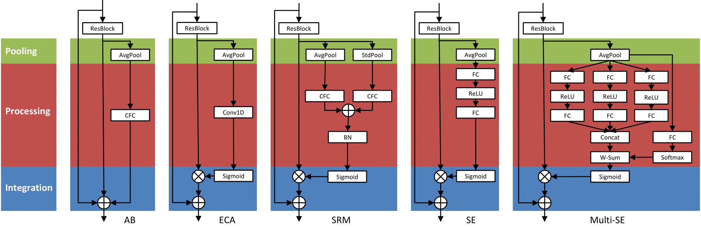
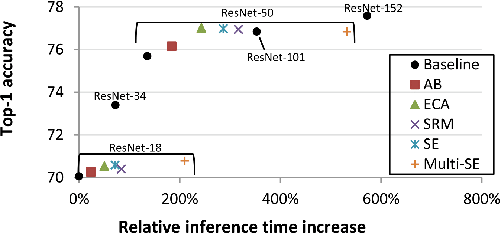
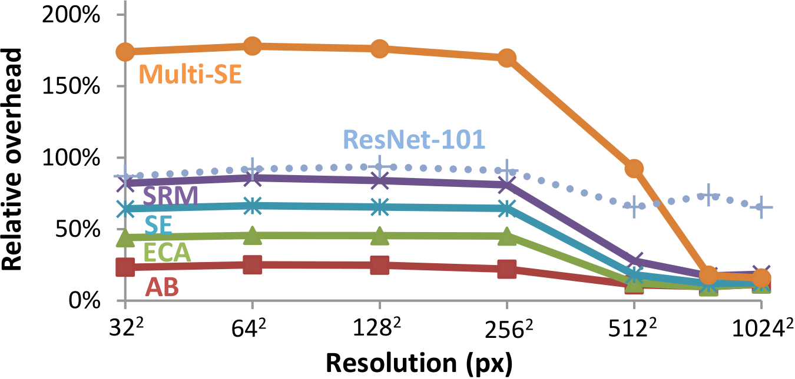

# Channel attention modules
This repository contains the official implementation of "Performance-Efficiency Comparisons of Channel Attention Modules for ResNets" for the ImageNet dataset. It includes optimized PyTorch implementations of several attention modules shown below.



The performance of attention modules compared to their computational cost varies strongly with several parameters. For example, even though the number of flops of all attention modules is negligble compared to the rest of the network, the time overhead when measured on a GPU varies strongly. 
For ImageNet size images (224x224 pixels), the tradeoff in computation time on an RTX2080 Ti favors simple modules such as AB and ECA.



However, module overhead scales very strongly with resolution, so make sure to select the best module for your use-case, as modern networks rarely use only 224x224  pixel resolutions.



For a more in-depth comparison of the modules, feel free to read our paper.

## Requirements
Training requires the following packages:
- PyTorch 1.6.0
- Python 3.7.6
- CUDA 10.2.89

Optionally, for TensorRT timing measurements, TensorRT 7.0.0.11 can be installed. Note that TensorRT can be difficult to install in an Anaconda environment.

## Code Examples
* Train **ResNet-50**
```
python imagenet.py --depth 50 --data /data/imagenet/ILSVRC2012 --gpu-id 0,1 --checkpoint resnet50/baseline
```

* Train **ResNet-50** with AB module
```
python imagenet.py --depth 50 --data /data/imagenet/ILSVRC2012 --gpu-id 0,1 --checkpoint resnet50/ab --recalibration-type meanrew
```

## Acknowledgments
The code is forked and altered from the publically available [style-based recalibration module](https://github.com/hyunjaelee410/style-based-recalibration-module) implementation, which in turn is heavily based on [pytorch-classification](https://github.com/bearpaw/pytorch-classification).
